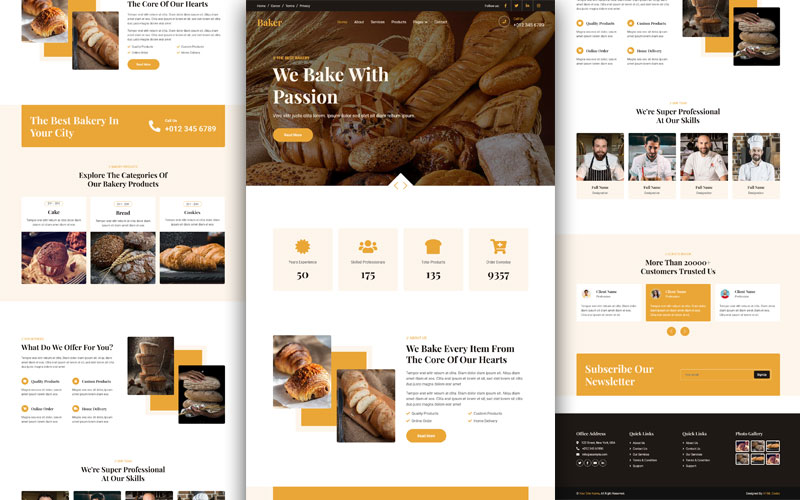

<h1 align="center">🍞 Bakery Website Template</h1>

<p align="center">
Welcome to the <strong>Bakery Website Template</strong>! This project is a modern, fully responsive, and visually appealing HTML/CSS template for bakeries, pastry shops, or any food-related businesses.
</p>

---

<h2 align="center">🌟 Demo</h2>

<p align="center">
Check out the live demo of this template here:<br>
<a href="https://akramkhattab.github.io/Bakery">Bakery Website Live Demo</a>
</p>

<p align="center">
  
</p>

---

<h2 align="center">📋 Project Overview</h2>

<p align="center">
The <strong>Bakery Website Template</strong> is designed to provide a professional online presence for bakery businesses. It features an elegant design, rich visuals, and organized content to highlight products, services, and customer trust.
</p>

<h3 align="center">Key Features</h3>

<p align="center">
- <strong>Fully Responsive</strong>: Works seamlessly on all devices (mobile, tablet, desktop).<br>
- <strong>User-Friendly Design</strong>: Easy navigation with modern UI elements.<br>
- <strong>Hero Section</strong>: A stunning banner with an eye-catching call-to-action button.<br>
- <strong>Feature Highlights</strong>: Display bakery products, services, and offerings.<br>
- <strong>About Us</strong>: Showcase your expertise and team skills with visuals.<br>
- <strong>Customer Trust</strong>: Include reviews, testimonials, and statistics to build trust.<br>
- <strong>Newsletter Signup</strong>: Allows visitors to subscribe for updates.<br>
- <strong>Footer Section</strong>: Includes quick links, social media icons, and contact info.
</p>

---

<h2 align="center">🛠️ Technologies Used</h2>

<p align="center">
- <strong>HTML5</strong>: Structure of the website.<br>
- <strong>CSS3</strong>: Styling and layout.<br>
- <strong>Bootstrap</strong>: CSS framework.<br>
- <strong>FontAwesome</strong>: Icons for enhancing the design.<br>
- <strong>Google Fonts</strong>: For beautiful typography.
</p>

---

<h2 align="center">🚀 How to Use</h2>

<p align="center">
Follow these steps to use or modify this template:
</p>

<p align="center"><strong>Clone the Repository</strong></p>

```bash
git clone https://github.com/AkramKhattab/Bakery.git
```

<h2 align="center">🤝 Contributions</h2>
<p align="center">
  Contributions are welcome! If you would like to enhance this project, feel free to:<br><br>
  1- Fork the Repository<br>
  2- Create a Feature Branch<br>
  3- Submit a Pull Request
</p>

<h2 align="center">📧 Contact</h2>
<p align="center">
  If you have any questions or feedback, please reach out:<br><br>
  <strong>Name</strong>: Akram Khattab<br>
  <strong>Email</strong>: <a href="mailto:AkramMKhattab@gmail.com">AkramMKhattab@gmail.com</a><br>
  <strong>LinkedIn</strong>: <a href="https://linkedin.com/in/akram-khattab">linkedin.com/in/akram-khattab</a><br>
  <strong>GitHub</strong>: <a href="https://github.com/AkramKhattab">github.com/AkramKhattab</a>
</p>

<h2 align="center">📄 License</h2>
<p align="center">
  This project is open-source and available under the <strong>MIT License</strong>.
</p>

<p align="center">
  Thank you for using the <strong>Bakery Website Template</strong>! 🍪🥐
</p>
